<p align="center">
  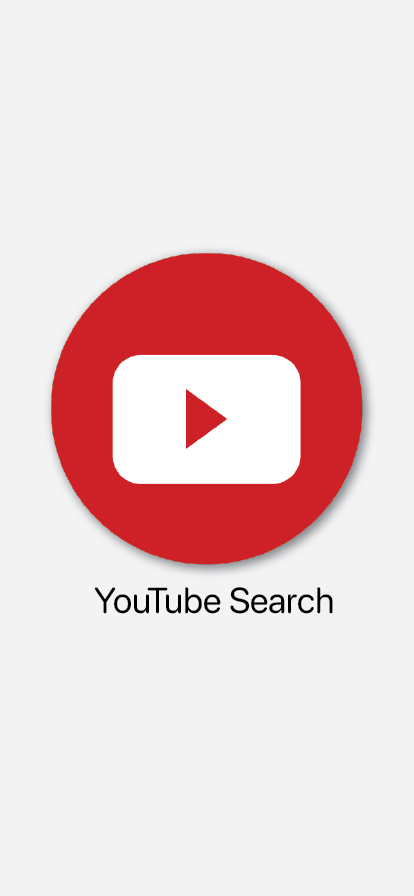
</p>

# YTSearch - Youtube React Native App
React Native App created for iOS, Android and Web with Youtube Google Data API to retrieve some videos according to the user's search.

See the [demos on Snack/Expo](https://snack.expo.io/@appdevcanada/youtube-video-search?&preview=true&platform=ios&supportedPlatforms=android,ios,web).

## Quickstart

First, clone the repository:

```bash
git clone https://github.com/appdevcanada/Youtube-Video-Search.git rn-ytsearch
cd rn-ytsearch

# install the dependencies
npm install

# start the server
expo start
```

## Configuring the Application

This app uses [Google Data API](https://developers.google.com/youtube/v3/?hl=en_GB) for Youtube content search. In order to test the application, you can use my API key, but for your own development, please register there and get yours. After getting the API key, go to `/config/API.js` and change the `API_KEY =` to your API key value.

## Starting the Application

```bash
expo start
```

This will open the browser with the available options to test the application.
Select iOS, Android or Web to open it in the simulator, or in your device. In order to run in simulators, you need to have them previously installed.

## Used Libraries

This app uses the following technologies/libraries:

* expo
* expo-screen-orientation
* native-base
* react
* react-native
* react-native-web
* react-native-webview
* And much much more

## Contributing

Fell free to clone this repository and contribute with more functionality, new ideas and improvements.

```shell
git clone https://github.com/appdevcanada/Near-You-Restaurants-Yelp.git rn-resto-yelp
cd rn-resto-yelp
npm install
expo start
```
___

## Screenshots

**iOS** | **Android** | **Web**
|:---:|:---:|:---:|
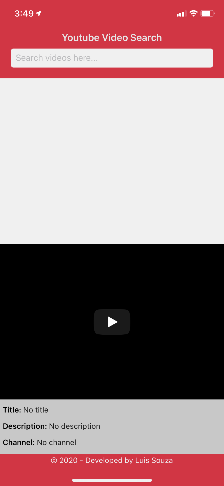 | 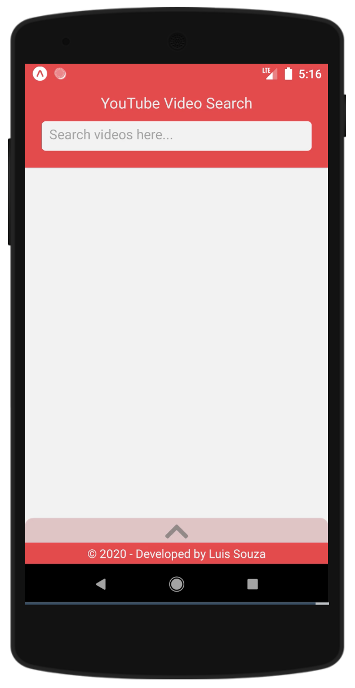 | 
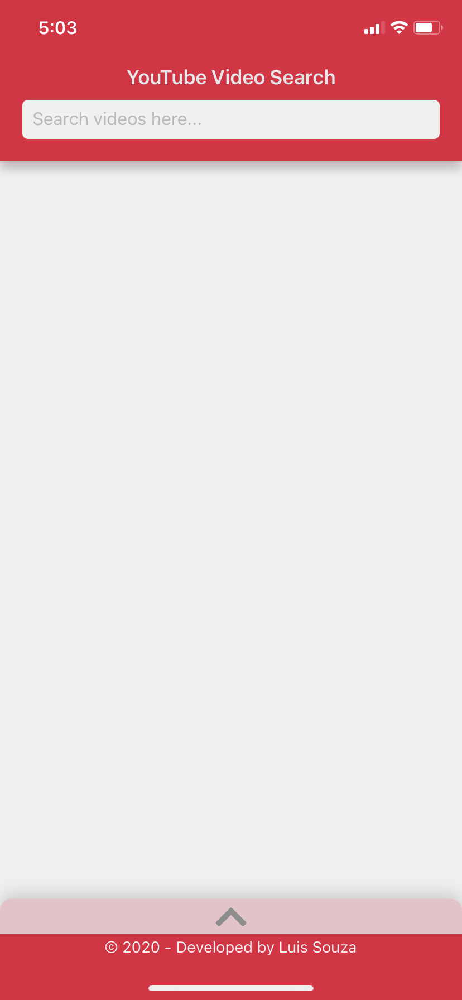	| 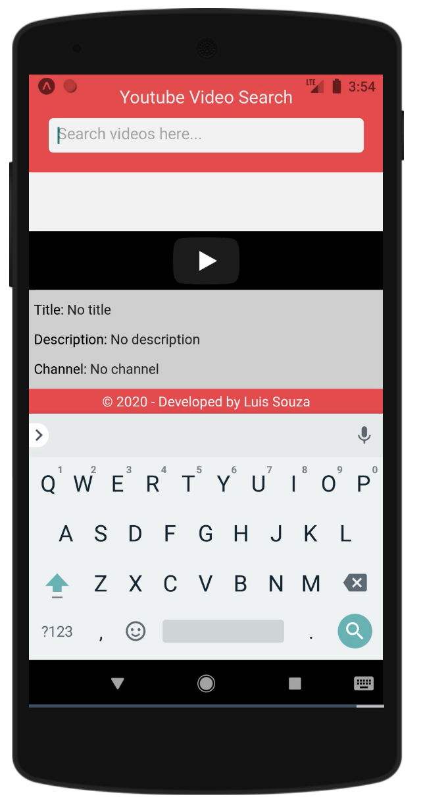 | 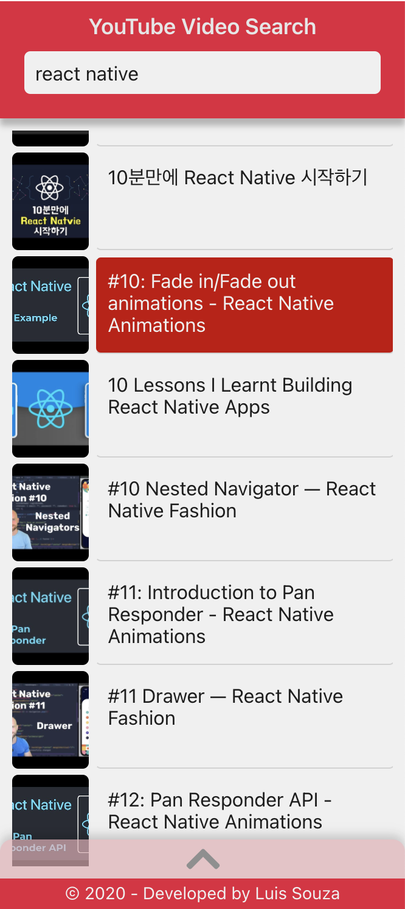
	| 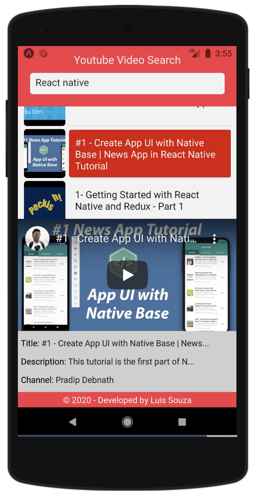 | 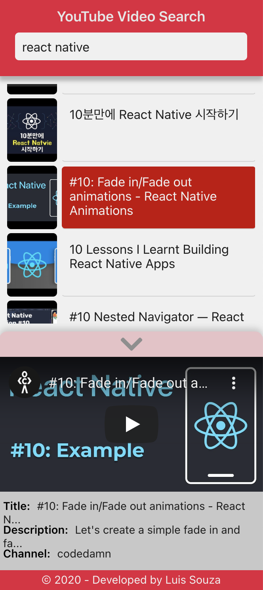
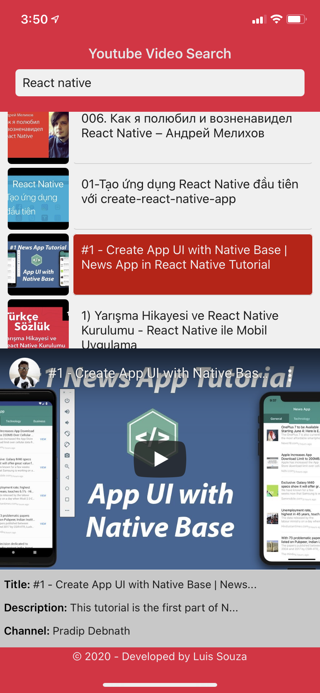	| 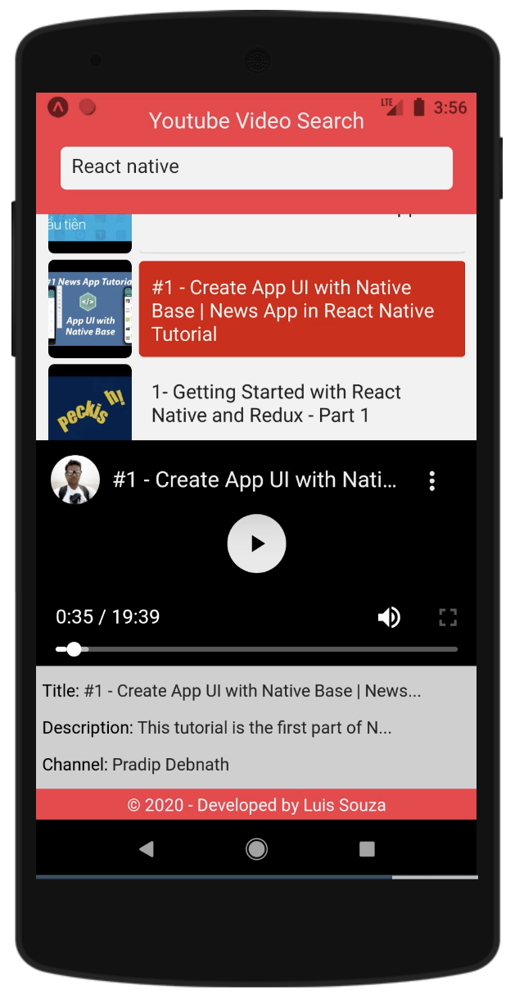 |
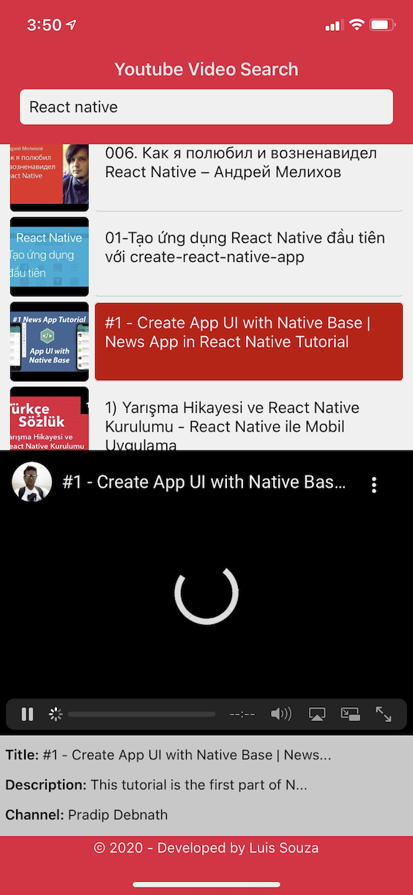	|  |
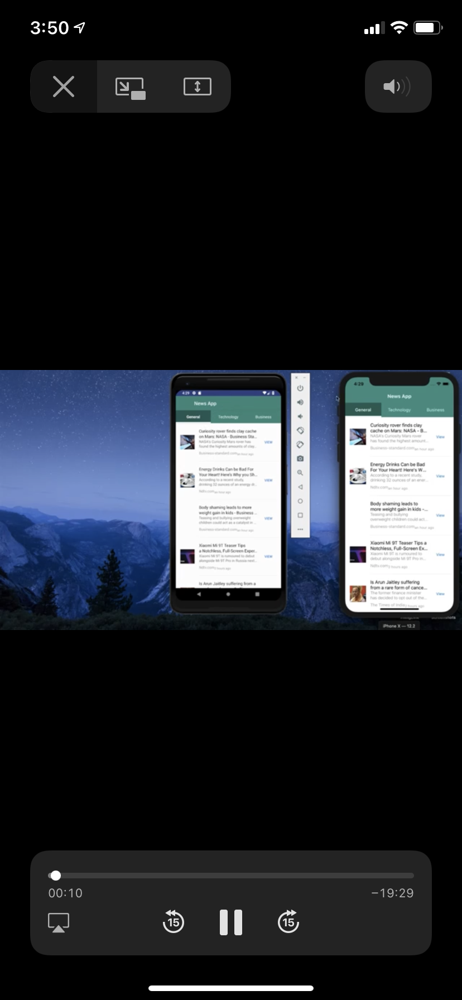 |  |
 |  |
